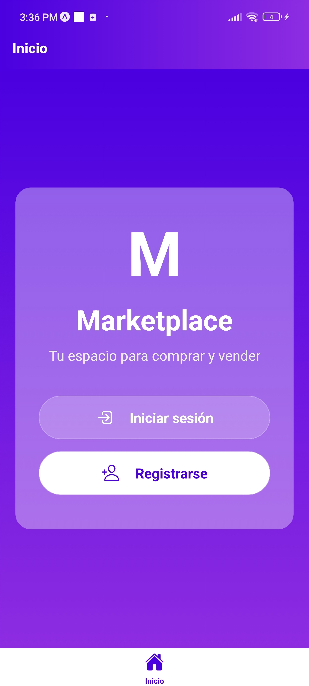
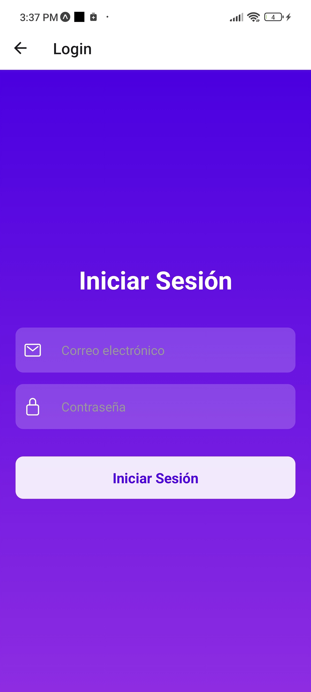
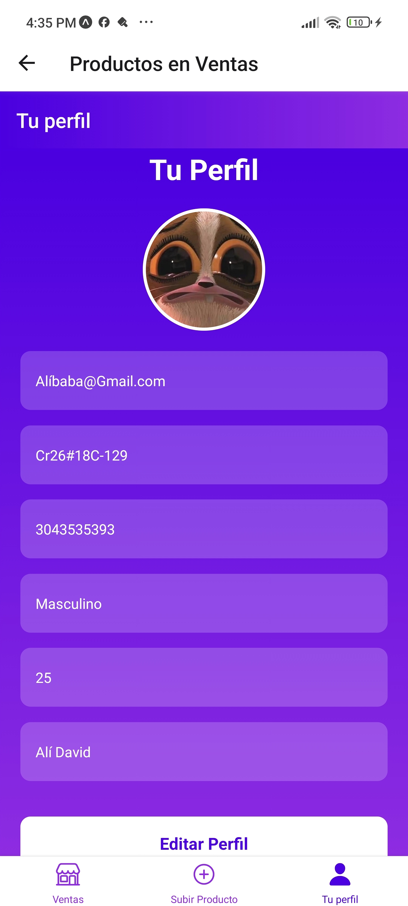
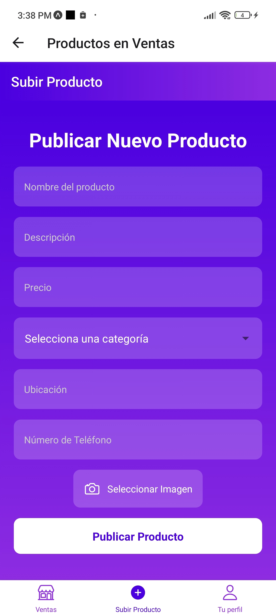

# Marketplace App React Native

Esta aplicación móvil de Marketplace, desarrollada con React Native, ofrece una plataforma moderna y fácil de usar para comprar y vender productos. Con un diseño atractivo y una experiencia de usuario intuitiva, esta app permite a los usuarios gestionar sus perfiles, publicar productos y explorar ofertas de otros vendedores.

## Características Principales

- **Autenticación de Usuarios**: Registro seguro e inicio de sesión.
- **Exploración de Productos**: Visualización y filtrado de productos por categorías.
- **Gestión de Productos**: Publicación, edición y eliminación de productos.
- **Perfil de Usuario**: Visualización y edición de información personal.
- **Diseño Moderno**: Interfaz atractiva con gradientes y componentes estilizados.
- **Experiencia Fluida**: Navegación intuitiva y carga eficiente de datos.

## Tecnologías Utilizadas

- React Native
- Expo
- Firebase (Autenticación, Firestore, Storage)
- React Navigation
- Expo Image Picker
- React Native Vector Icons
- @react-native-picker/picker

## Estructura del Proyecto

- `marketplace-app/`

  - `assets/`
    - (archivos de imágenes y recursos)
  - `src/`

    - `components/`
      - `Home.js`: Pantalla de inicio
      - `Login.js`: Pantalla de inicio de sesión
      - `AgregarUsuario.js`: Pantalla para agregar usuarios
      - `Venta.js`: Pantalla de ventas
      - `AgregarProducto.js`: Pantalla para agregar productos
      - `PerfilUsuario.js`: Pantalla de perfil de usuario
      - `EditProducto.js`: Pantalla para editar productos
      - `Detalles.js`: Pantalla de detalles de producto
    - `config/`
      - `firebaseConfig.js`: Configuración de Firebase
      - `babelconfig.js`: configuración de babel
    - `services/`
      - `.firebaserc`: servicio de base de datos

  - `App.js`: Componente principal de la aplicación
  - `App.json`
  - `package-lock.json`
  - `package.json`
  - `babel.config.js`

## Instalación

1. Clona este repositorio:

   ```bash
   git clone https://github.com/tu-usuario/marketplace-app.git
   ```

2. Navega al directorio del proyecto:

   ```bash
   cd marketplace-app
   ```

3. Instala las dependencias necesarias:

   ```bash
   npm install
   ```

4. Inicia la aplicación:

   ```bash
   npm start

   ```

## Uso

1. Registro/Inicio de Sesión:

- Accede a tu cuenta existente o crea una nueva desde la pantalla de inicio.

- Si eres un usuario nuevo, sigue las instrucciones para registrarte y configurar tu perfil.

2. Explorar Productos:

- Navega por la lista de productos disponibles.

- Utiliza los filtros (si los hay) para refinar tus resultados y encontrar exactamente lo que buscas.

3. Publicar un Producto:

- Si tienes algo que vender, haz clic en “Subir Producto”.

- Completa el formulario proporcionando los detalles del artículo: título, descripción, precio, etc.

4. Gestionar Perfil:

- Accede a “Tu Perfil” para ver y editar tu información personal.

- Actualiza tu foto de perfil, cambia tu contraseña o modifica cualquier otro dato relevante.

5. Editar Productos:

- Desde la vista detallada de tus productos (si eres un vendedor), puedes editar la información de un artículo existente.

- También puedes eliminar productos que ya no deseas ofrecer.

## Capturas de Pantalla

<div align="center">
  
  
  
  
  
  
</div>

## Contribución

Las contribuciones son bienvenidas. Por favor, sigue estos pasos para contribuir:

1. Haz un fork del repositorio
2. Crea una nueva rama (`git checkout -b feature/AmazingFeature`)
3. Haz commit de tus cambios (`git commit -m 'Add some AmazingFeature'`)
4. Haz push a la rama (`git push origin feature/AmazingFeature`)
5. Abre un Pull Request

## Licencia

Este proyecto está bajo la Licencia MIT. Consulta el archivo [LICENSE](LICENSE) para más detalles.

## Enlace del proyecto:

- [Agenda de Contactos React](https://contacts-agenda-made-with-react.netlify.app/)

## Contacto

Maximiliano Cervantes Mendoza - mc349821@Gmail.com

---

¿Si necesitas ayuda con alguna parte del proyecto? ¡No dudes en contactarme!

- [LinkedIn](https://www.linkedin.com/in/maximiliano-cervantes-ing/)

- [GitHub](https://github.com/Maxcerva12)
